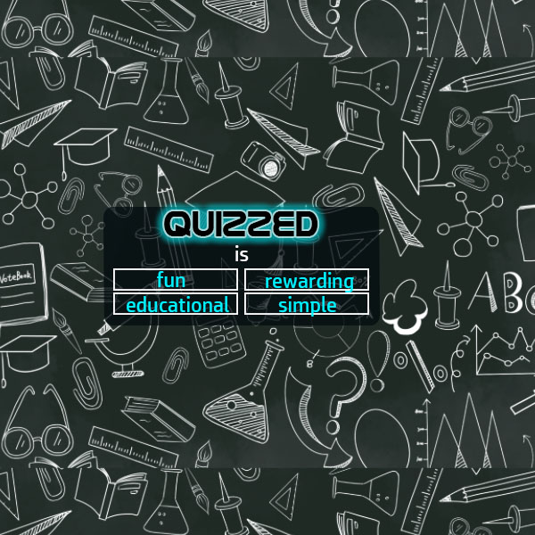

# Quizzed

## Description

A short entry level JavaScript quiz designed to test correct and incorrect answers, employ a timer, and save high score

## Table of Contents

1. [Screenshot](#screenshot)
1. [License](#license)
1. [Links](#links)
1. [Questions](#support)

---

## Screenshot

---

## License

[MIT](url)

## Links

### Repo Link:

[Repo](https://github.com/8BitGinger/quizzed)

### Deployed Link:

[Live](https://8BitGinger.github.io/quizzed)

## Questions

Reach out for Questions or Support here:

### Email:

ryan.fann@gmail.com

#### GitHub Username:

[8BitGinger](https://github.com/8BitGinger)
